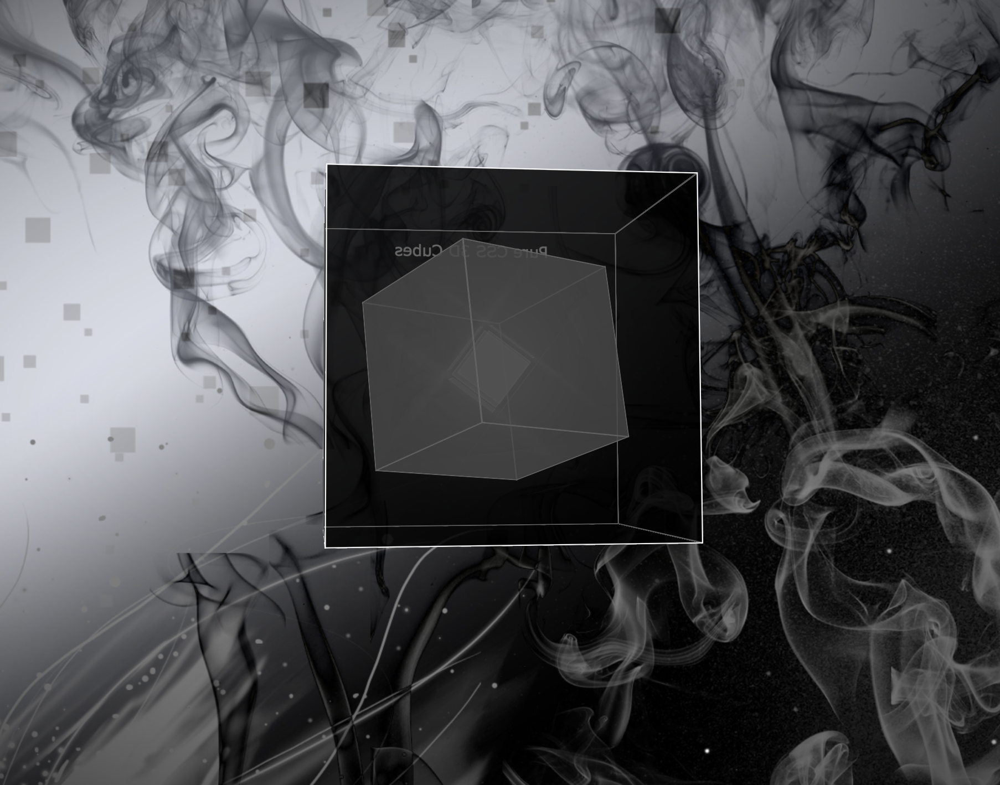

# Pure CSS 3D Cubes

[LIVE DEMO](https://marclopezavila.github.io/pure-css-3d-cubes)

[CODEPEN](https://codepen.io/Loopez10/pen/zqMWYQ)

Three 3D cubes, one inside the other. Playing a bit with CSS transformations :P

